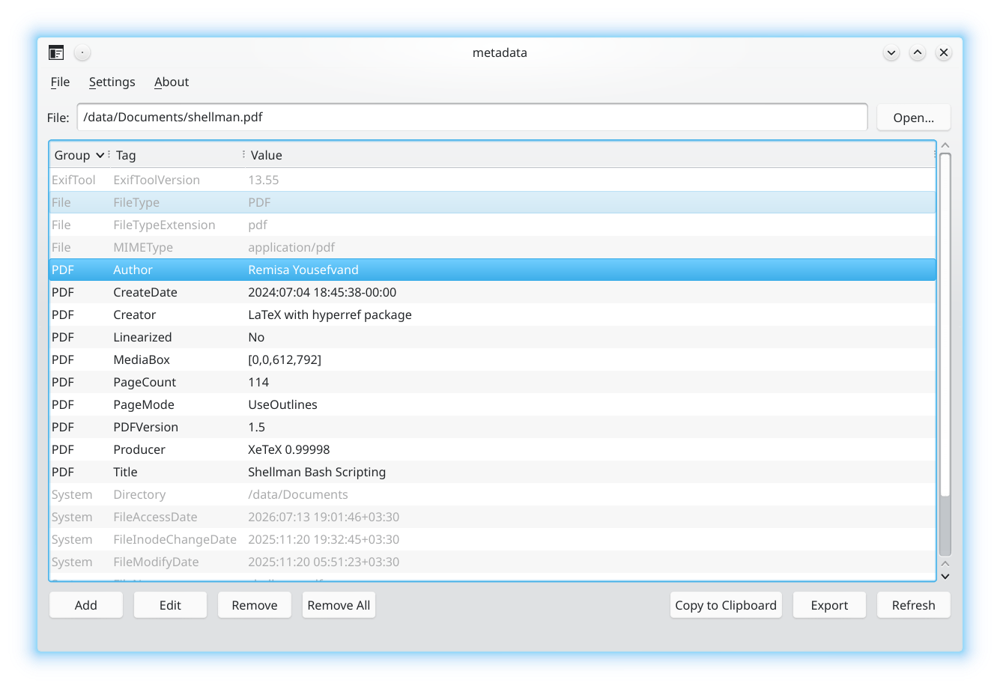

# metadata 0.2.0



A Qt 6/C++ desktop application for Arch Linux KDE Wayland that reads and edits
file metadata through ExifTool. It supports opening a file directly or through a
Dolphin context-menu action.

## Features

- View metadata grouped by ExifTool group and tag.
- Add a metadata tag.
- Edit a selected metadata tag.
- Remove a selected metadata tag.
- Remove all removable metadata.
- Copy metadata to the clipboard as a minimal ASCII key/value table.
- Export metadata to a UTF-8 text file as a minimal ASCII key/value table.
- Configure copy and export independently to include all fields or only editable
  fields.
- Open File, About metadata, and About Qt menu actions.
- Accept a file path as a command-line argument for file-manager integration.
- Use qpdf to rewrite PDFs after metadata changes and discard old incremental
  objects.
- Block Remove All for proprietary camera RAW formats because their metadata may
  be rendering-critical.

Copy defaults to editable key/values. Export defaults to all key/values. Exported
files initially use the complete source filename followed by `.txt`; for example,
`report.pdf` becomes `report.pdf.txt`.

## Runtime architecture

The GUI is native Qt 6 Widgets/C++. Metadata operations are delegated to the
`exiftool` executable supplied by Arch package `perl-image-exiftool`. PDF
rewriting uses `qpdf`.

ExifTool does not guarantee complete metadata removal for every file format.
JPEG removal is the most complete; TIFF, PNG, PDF, PostScript, MOV/MP4, and RAW
formats have format-specific limitations. The application uses qpdf for PDFs,
but no general-purpose tool can promise that every proprietary or structural
field in every format is safely removable.

## Installation

### Arch Linux (AUR)

```bash
yay -S metadata
```

The AUR repository contains packaging metadata only. The package build downloads
the tagged source archive from the GitHub project.

### Build from source

```bash
sudo pacman -S --needed base-devel cmake ninja qt6-base \
  perl-image-exiftool qpdf hicolor-icon-theme
cmake -S . -B build -G Ninja -DCMAKE_BUILD_TYPE=Release \
  -DCMAKE_INSTALL_PREFIX=/usr
cmake --build build
./build/metadata
```

### Install and uninstall scripts

```bash
chmod +x Install.sh Uninstall.sh aur.sh
./Install.sh
./Uninstall.sh
```

`Install.sh` installs the application into `/usr` by default and asks:

```text
Do you want to add "Show metadata" to your file manager? [Y/n]
```

The default is yes. On KDE it detects Dolphin/Konqueror and creates an executable
user service-menu file at:

```text
~/.local/share/kio/servicemenus/metadata-show.desktop
```

`Uninstall.sh` removes application-specific files, that service menu, the local
build directory, and installer state. It intentionally does not remove shared
system packages such as Qt, ExifTool, or qpdf.

Use a different installation prefix with:

```bash
PREFIX=/usr/local ./Install.sh
```

## Metadata tag examples

```text
XMP-dc:Title
XMP-dc:Description
EXIF:Artist
IPTC:Keywords
PDF:Author
```

Whether a tag is writable depends on the destination file format and ExifTool.
Read-only ExifTool groups such as File, System, ExifTool, and Composite are shown
in the table but cannot be edited in the GUI.

## License

MIT. See `LICENSE`.
